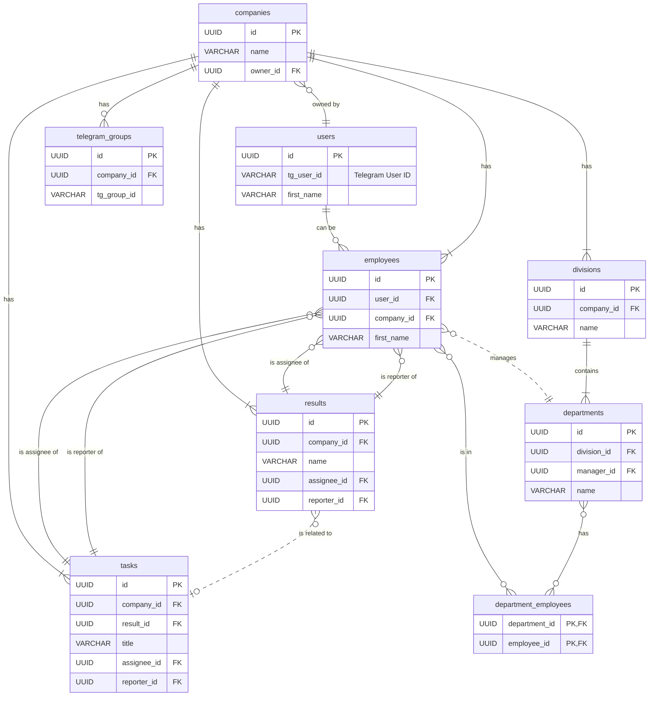

# FINEKO Database Schema Specification

This document outlines the recommended database schema for the FINEKO application, designed for a relational database like PostgreSQL.

## Table of Contents
1.  [Core Tables](#1-core-tables)
2.  [Task Management Tables](#2-task-management-tables)
3.  [Organizational Structure Tables](#3-organizational-structure-tables)
4.  [Content & Process Tables](#4-content--process-tables)
5.  [Integration Tables](#5-integration-tables)
6.  [Relationships Diagram (ERD)](#6-relationships-diagram-erd)

---

## 1. Core Tables

### `users`
Stores global user accounts, authenticated via Telegram.

| Column           | Type               | Description                               | Notes                               |
| ---------------- | ------------------ | ----------------------------------------- | ----------------------------------- |
| **id**           | `UUID` / `VARCHAR` | **Primary Key** - Unique user identifier. |                                     |
| tg_user_id       | `VARCHAR`          | User's unique ID from Telegram.           | **Unique**, Indexed for lookups.    |
| telegram_username| `VARCHAR`          | User's Telegram @username.                | Optional.                           |
| first_name       | `VARCHAR`          | User's first name.                        |                                     |
| last_name        | `VARCHAR`          | User's last name.                         | Optional.                           |
| photo_url        | `VARCHAR` (URL)    | URL to the user's Telegram avatar.        | Optional.                           |
| created_at       | `TIMESTAMPZ`       | Timestamp of user creation.               | `DEFAULT NOW()`                     |
| updated_at       | `TIMESTAMPZ`       | Timestamp of last user update.            | `DEFAULT NOW()`                     |

### `companies`
Represents a workspace or an organization.

| Column     | Type               | Description                                 | Notes                               |
| ---------- | ------------------ | ------------------------------------------- | ----------------------------------- |
| **id**     | `UUID` / `VARCHAR` | **Primary Key** - Unique company identifier.|                                     |
| name       | `VARCHAR`          | The name of the company.                    |                                     |
| owner_id   | `UUID` / `VARCHAR` | **Foreign Key** to `users.id`.              | The user who created the company.   |
| created_at | `TIMESTAMPZ`       | Timestamp of company creation.              | `DEFAULT NOW()`                     |
| updated_at | `TIMESTAMPZ`       | Timestamp of last company update.           | `DEFAULT NOW()`                     |

### `employees`
A **join table** linking a `user` to a `company`.

| Column        | Type                     | Description                                    | Notes                               |
| ------------- | ------------------------ | ---------------------------------------------- | ----------------------------------- |
| **id**        | `UUID` / `VARCHAR`       | **Primary Key** - Unique employee identifier.  |                                     |
| user_id       | `UUID` / `VARCHAR`       | **Foreign Key** to `users.id`.                 | Null if created via TG group import.|
| **company_id**| `UUID` / `VARCHAR`       | **Foreign Key** to `companies.id`.             |                                     |
| first_name    | `VARCHAR`                | Employee's first name (can differ from user).  |                                     |
| last_name     | `VARCHAR`                | Employee's last name.                          |                                     |
| status        | `VARCHAR`                | `'active', 'vacation', 'inactive'`             |                                     |
| notes         | `TEXT`                   | Administrative notes about the employee.       | Optional.                           |
| created_at    | `TIMESTAMPZ`             | Timestamp of when the user joined the company. | `DEFAULT NOW()`                     |

*Note: A composite unique key on `(user_id, company_id)` is recommended.*

---

## 2. Task Management Tables

### `results`
Stores long-term goals or OKRs.

| Column           | Type               | Description                                  |
| ---------------- | ------------------ | -------------------------------------------- |
| **id**           | `UUID` / `VARCHAR` | **Primary Key**                              |
| **company_id**   | `UUID` / `VARCHAR` | **Foreign Key** to `companies.id`.           |
| name             | `VARCHAR`          | Name of the result/goal.                     |
| description      | `TEXT`             | Detailed description.                        |
| status           | `VARCHAR`          | e.g., 'In Progress', 'Planned', 'Done'       |
| completed        | `BOOLEAN`          | Whether the result is fully completed.       |
| deadline         | `DATE`             | The target completion date.                  |
| assignee_id      | `UUID` / `VARCHAR` | **Foreign Key** to `employees.id`.           |
| reporter_id      | `UUID` / `VARCHAR` | **Foreign Key** to `employees.id`.           |
| expected_result  | `TEXT`             | A clear definition of done.                  |
| access_list      | `JSONB`            | Array of `employee.id` who have access.      |

### `sub_results`
Checklist items for a parent `Result`.

| Column          | Type               | Description                                |
| --------------- | ------------------ | ------------------------------------------ |
| **id**          | `UUID` / `VARCHAR` | **Primary Key**                            |
| **result_id**   | `UUID` / `VARCHAR` | **Foreign Key** to `results.id`.           |
| name            | `VARCHAR`          | The name of the sub-task.                  |
| completed       | `BOOLEAN`          | `DEFAULT false`                            |
| order           | `INTEGER`          | The display order of the sub-result.       |

### `tasks`
Daily, actionable items.

| Column          | Type               | Description                                |
| --------------- | ------------------ | ------------------------------------------ |
| **id**          | `UUID` / `VARCHAR` | **Primary Key**                            |
| **company_id**  | `UUID` / `VARCHAR` | **Foreign Key** to `companies.id`.         |
| result_id       | `UUID` / `VARCHAR` | **Foreign Key** to `results.id`.           |
| title           | `VARCHAR`          | The task's title.                          |
| description     | `TEXT`             | Detailed description.                      |
| due_date        | `DATE`             | The date the task is due.                  |
| status          | `VARCHAR`          | `'todo', 'done'`                           |
| type            | `VARCHAR`          | Eisenhower Matrix category.                |
| expected_time   | `INTEGER`          | Estimated time in minutes.                 |
| actual_time     | `INTEGER`          | Actual time spent in minutes.              |
| expected_result | `TEXT`             | Description of the expected outcome.       |
| actual_result   | `TEXT`             | Description of the actual outcome.         |
| assignee_id     | `UUID` / `VARCHAR` | **Foreign Key** to `employees.id`.         |
| reporter_id     | `UUID` / `VARCHAR` | **Foreign Key** to `employees.id`.         |

### `templates`
For creating recurring tasks.

| Column         | Type               | Description                              |
| -------------- | ------------------ | ---------------------------------------- |
| **id**         | `UUID` / `VARCHAR` | **Primary Key**                          |
| **company_id** | `UUID` / `VARCHAR` | **Foreign Key** to `companies.id`.       |
| name           | `VARCHAR`          | Name of the template.                    |
| repeatability  | `VARCHAR`          | Cron string or human-readable schedule.  |
| task_details   | `JSONB`            | JSON object with task properties.        |

---

## 3. Organizational Structure Tables

### `divisions`
The highest-level organizational units.

| Column        | Type               | Description                          |
| ------------- | ------------------ | ------------------------------------ |
| **id**        | `UUID` / `VARCHAR` | **Primary Key**                      |
| **company_id**| `UUID` / `VARCHAR` | **Foreign Key** to `companies.id`.   |
| name          | `VARCHAR`          | Name of the division.                |
| description   | `TEXT`             | A brief description.                 |
| order         | `INTEGER`          | Display order.                       |

### `departments`
Sub-units within a Division.

| Column          | Type               | Description                               |
| --------------- | ------------------ | ----------------------------------------- |
| **id**          | `UUID` / `VARCHAR` | **Primary Key**                           |
| **division_id** | `UUID` / `VARCHAR` | **Foreign Key** to `divisions.id`.        |
| manager_id      | `UUID` / `VARCHAR` | **Foreign Key** to `employees.id`.        |
| name            | `VARCHAR`          | Name of the department.                   |
| ckp             | `TEXT`             | "Цінний Кінцевий Продукт"               |

### `department_employees`
A **many-to-many join table** linking employees to departments.

| Column            | Type               | Description                        |
| ----------------- | ------------------ | ---------------------------------- |
| **department_id** | `UUID` / `VARCHAR` | **Foreign Key** to `departments.id`. |
| **employee_id**   | `UUID` / `VARCHAR` | **Foreign Key** to `employees.id`.   |

*Note: The primary key is a composite key on `(department_id, employee_id)`.*

---

## 4. Content & Process Tables

### `processes`
Stores business process diagrams.

| Column        | Type               | Description                               |
| ------------- | ------------------ | ----------------------------------------- |
| **id**        | `UUID` / `VARCHAR` | **Primary Key**                           |
| **company_id**| `UUID` / `VARCHAR` | **Foreign Key** to `companies.id`.        |
| name          | `VARCHAR`          | Name of the process.                      |
| description   | `TEXT`             | Description of the process.               |
| data          | `JSONB`            | JSON containing lanes, steps, etc.        |

### `instructions`
A knowledge base for the company.

| Column        | Type               | Description                               |
| ------------- | ------------------ | ----------------------------------------- |
| **id**        | `UUID` / `VARCHAR` | **Primary Key**                           |
| **company_id**| `UUID` / `VARCHAR` | **Foreign Key** to `companies.id`.        |
| title         | `VARCHAR`          | The title of the instruction.             |
| content       | `TEXT`             | The main content (HTML/Markdown).         |
| department_id | `UUID` / `VARCHAR` | **Foreign Key** to `departments.id`.      |

### `instruction_access`
A **many-to-many join table** for access rights.

| Column            | Type               | Description                             |
| ----------------- | ------------------ | --------------------------------------- |
| **instruction_id**| `UUID` / `VARCHAR` | **Foreign Key** to `instructions.id`.   |
| **employee_id**   | `UUID` / `VARCHAR` | **Foreign Key** to `employees.id`.      |
| access_level      | `VARCHAR`          | `'view', 'edit'`                        |

*Note: The primary key is a composite key on `(instruction_id, employee_id)`.*

---

## 5. Integration Tables

### `telegram_groups`
Stores linked Telegram groups.

| Column          | Type               | Description                               |
| --------------- | ------------------ | ----------------------------------------- |
| **id**          | `UUID` / `VARCHAR` | **Primary Key**                           |
| **company_id**  | `UUID` / `VARCHAR` | **Foreign Key** to `companies.id`.        |
| tg_group_id     | `VARCHAR`          | The unique ID of the group from Telegram. |
| title           | `VARCHAR`          | The title of the Telegram group.          |
| linked_at       | `TIMESTAMPZ`       | When the group was linked.                |

### `group_link_codes`
Temporarily stores codes for linking groups.

| Column        | Type               | Description                               |
| ------------- | ------------------ | ----------------------------------------- |
| **code**      | `VARCHAR(6)`       | **Primary Key** - The unique code.        |
| tg_group_id   | `VARCHAR`          | The Telegram group ID to be linked.       |
| group_title   | `VARCHAR`          | The Telegram group title.                 |
| expires_at    | `TIMESTAMPZ`       | When the code becomes invalid.            |

---

## 6. Relationships Diagram (ERD)

